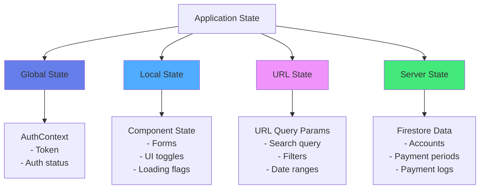
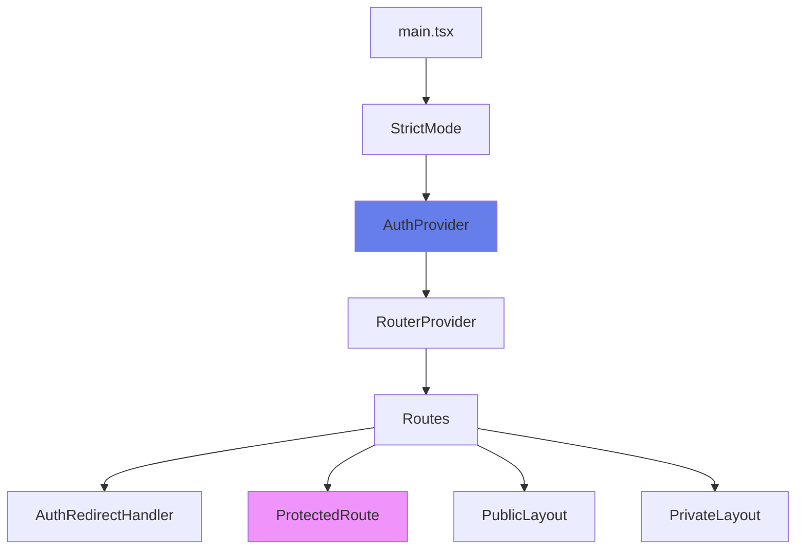
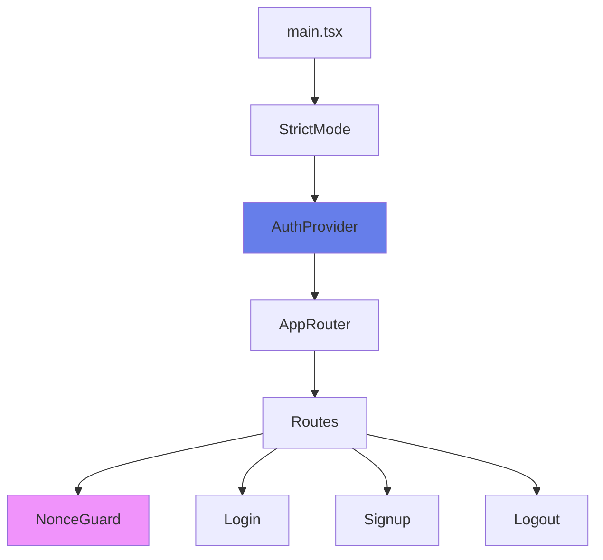
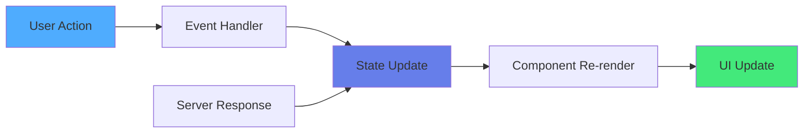

# State Management Documentation

This document provides a comprehensive overview of state management patterns used throughout the Rates monorepo.

## 1. State Management Overview

### Primary State Management Solution

The project uses **React's built-in state management** exclusively:

- **React Context API** for global/shared state
- **React Hooks** (`useState`, `useEffect`, `useMemo`, `useCallback`) for local component state
- **React Router** URL state for filter/search parameters
- **Custom service modules** for server state management

### Architecture Philosophy

The project follows a **minimalist approach** to state management:

- **No external state libraries**: No Redux, Zustand, MobX, or similar libraries
- **Context for authentication only**: Global state is limited to authentication
- **Component-local state**: Most state lives in components using hooks
- **URL as state**: Filter and search state is stored in URL query parameters
- **Service layer pattern**: Server state is managed through custom service functions

### Global vs Local State Boundaries



**Global State** (Context):

- Authentication token and status
- User session information

**Local State** (Component hooks):

- Form inputs and validation errors
- Modal open/close states
- Loading and error states
- UI interactions (expanded/collapsed sections)
- Component-specific calculations

**URL State** (React Router):

- Search queries
- Filter selections (status, type, currency)
- Date range parameters
- Navigation state

**Server State** (Firestore):

- Financial accounts
- Payment periods
- Payment logs
- Managed through service functions, not cached globally

---

## 2. Global State

### Store Structure

The project uses **React Context API** as the only global state mechanism. There are no Redux stores, Zustand stores, or similar state containers.

### Context Providers

#### 1. AuthContext (Consumer App - `apps/app`)

**Location**: `apps/app/src/contexts/AuthContext.tsx`

**Purpose**: Manages authentication state for the consumer application

**State Structure**:

```typescript
type AuthContextValue = {
  token: string | null;
  isAuthenticated: boolean;
  redirectToAuth: (
    path?: 'login' | 'signup' | 'session' | 'logout'
  ) => Promise<void>;
  signOut: () => Promise<void>;
};
```

**Key Features**:

- Uses `useSyncExternalStore` for token synchronization with localStorage
- Implements custom subscription pattern for token state changes
- Token validation via `isValidTokenFormat` utility
- Redirects to separate auth-app for authentication flows

**Implementation Pattern**:

```typescript
// Custom external store for token synchronization
let tokenState: string | null = null;
const listeners: Set<() => void> = new Set();

function getTokenSnapshot(): string | null {
  const result = getAuthToken(false);
  // ... validation and state updates
  return currentToken;
}

function subscribeToken(callback: () => void): () => void {
  listeners.add(callback);
  return () => listeners.delete(callback);
}

// Used with useSyncExternalStore
const token = useSyncExternalStore(
  subscribeToken,
  getTokenSnapshot,
  getTokenSnapshot
);
```

**Provider Hierarchy**:

```
<StrictMode>
  <AuthProvider>
    <RouterProvider>
      <Routes>
        ...
      </Routes>
    </RouterProvider>
  </AuthProvider>
</StrictMode>
```

#### 2. AuthContext (Auth App - `apps/auth-app`)

**Location**: `apps/auth-app/src/contexts/AuthContext.tsx`

**Purpose**: Manages Firebase authentication state for the authentication application

**State Structure**:

```typescript
type AuthContextValue = {
  user: User | null;
  loading: boolean;
  signIn: (email: string, password: string, remember: boolean) => Promise<User>;
  signUp: (email: string, password: string) => Promise<User>;
  signOut: () => Promise<void>;
};
```

**Key Features**:

- Uses Firebase Auth `onAuthStateChanged` listener
- Manages persistence (local vs session storage)
- Provides async authentication methods
- Loading state for initial auth check

**Implementation Pattern**:

```typescript
const [user, setUser] = useState<User | null>(null);
const [loading, setLoading] = useState(true);

useEffect(() => {
  const unsub = onAuthStateChanged(auth, (nextUser) => {
    setUser(nextUser);
    setLoading(false);
  });
  return unsub;
}, []);
```

**Provider Hierarchy**:

```
<StrictMode>
  <AuthProvider>
    <AppRouter>
      <Routes>
        ...
      </Routes>
    </AppRouter>
  </AuthProvider>
</StrictMode>
```

### Middleware and Enhancers

**None**. The project does not use any middleware, enhancers, or state management plugins. All state logic is implemented directly in components and contexts.

---

## 3. Server State

### Server State Management Approach

The project uses **custom service modules** for server state management. There is no React Query, SWR, Apollo Client, or similar server state library.

### Service Layer Pattern

Server state is managed through dedicated service modules that wrap Firestore operations:

#### 1. Financial Accounts Service

**Location**: `apps/app/src/services/financialAccounts.ts`

**Functions**:

- `getUserFinancialAccounts()`: Fetch all accounts for current user
- `getFinancialAccount(accountId)`: Fetch single account
- `createFinancialAccount(accountData)`: Create new account
- `updateFinancialAccount(accountId, updates)`: Update account
- `deleteFinancialAccount(accountId)`: Delete account (marks as closed)
- `logPayment(accountId, paymentData)`: Log payment to account

**Usage Pattern**:

```typescript
// In component
const [accounts, setAccounts] = useState<FinancialAccount[]>([]);
const [loading, setLoading] = useState(true);

useEffect(() => {
  async function loadAccounts() {
    try {
      setLoading(true);
      const allAccounts = await getUserFinancialAccounts();
      setAccounts(allAccounts);
    } catch (err) {
      setError(err.message);
    } finally {
      setLoading(false);
    }
  }
  loadAccounts();
}, []);
```

#### 2. Payment Periods Service

**Location**: `apps/app/src/services/paymentPeriods.ts`

**Functions**:

- `getPaymentPeriods(accountNumber)`: Fetch all periods for account
- `getUnpaidPaymentPeriods(accountNumber, daysAhead)`: Fetch unpaid periods
- `createPaymentPeriod(periodData)`: Create period
- `logPaymentToPeriod(accountNumber, periodNumber, paymentData)`: Log payment to period
- `generateAmortizationPlanForAccount(accountNumber, regenerate)`: Generate payment plan
- `extendPeriodicBillPeriods(accountNumber)`: Extend periodic bill periods
- `batchLogPaymentsToPeriods(...)`: Batch log multiple payments

### Caching Strategy

**No automatic caching**. Each component manages its own data fetching:

- **Manual refetching**: Components call service functions when needed
- **No cache invalidation**: Data is refetched after mutations
- **No background updates**: No automatic polling or real-time subscriptions
- **Firestore snapshots**: Direct Firestore queries, not cached

### Query Keys

**Not applicable**. Since there's no query library, there are no query keys. Components identify data by:

- Account number (for accounts and periods)
- User ID (for user's accounts)
- Period number (for specific periods)

### Optimistic Updates

**Not implemented**. The project does not use optimistic updates. All UI updates happen after successful server responses:

```typescript
// Example: Logging payment
const handleSubmit = async () => {
  setIsSubmitting(true);
  try {
    await logPayment(accountNumber, paymentData);
    // UI updates only after success
    onPaymentLogged(); // Triggers parent to refetch
  } catch (err) {
    setError(err.message);
  } finally {
    setIsSubmitting(false);
  }
};
```

### Real-time Subscriptions

**Not used**. The project uses one-time Firestore queries (`getDocs`, `getDoc`) rather than real-time listeners (`onSnapshot`). Components refetch data when needed (e.g., after mutations, on mount, on route changes).

---

## 4. Context Providers

### Provider List

#### 1. AuthProvider (Consumer App)

**File**: `apps/app/src/contexts/AuthContext.tsx`

**Provides**:

- `token`: Current authentication token (string | null)
- `isAuthenticated`: Boolean indicating if user is authenticated
- `redirectToAuth(path)`: Redirects to auth-app for authentication
- `signOut()`: Clears token and redirects to logout

**Consumers**:

- `ProtectedRoute`: Checks authentication before rendering
- `AuthRedirectHandler`: Handles auth redirects
- `PrivateLayout`: Requires authentication
- All protected pages

**Hook**: `useAuth()`

#### 2. AuthProvider (Auth App)

**File**: `apps/auth-app/src/contexts/AuthContext.tsx`

**Provides**:

- `user`: Firebase User object (User | null)
- `loading`: Boolean for initial auth check
- `signIn(email, password, remember)`: Sign in method
- `signUp(email, password)`: Sign up method
- `signOut()`: Sign out method

**Consumers**:

- `Login`: Uses signIn method
- `Signup`: Uses signUp method
- `Logout`: Uses signOut method
- `Session`: Displays user info
- `NonceGuard`: Checks auth state

**Hook**: `useAuth()`

### Provider Hierarchy

#### Consumer App (`apps/app`)



**Hierarchy**:

```
<StrictMode>
  <AuthProvider>
    <RouterProvider>
      <Routes>
        <Route element={<AuthRedirectHandler />}>
          <Route path="/login" element={<PublicLayout><Login /></PublicLayout>} />
          <Route path="/dashboard" element={
            <ProtectedRoute>
              <PrivateLayout>
                <Dashboard />
              </PrivateLayout>
            </ProtectedRoute>
          } />
        </Route>
      </Routes>
    </RouterProvider>
  </AuthProvider>
</StrictMode>
```

#### Auth App (`apps/auth-app`)



**Hierarchy**:

```
<StrictMode>
  <AuthProvider>
    <AppRouter>
      <Routes>
        <Route path="/login" element={<NonceGuard><Login /></NonceGuard>} />
        <Route path="/signup" element={<NonceGuard><Signup /></NonceGuard>} />
        ...
      </Routes>
    </AppRouter>
  </AuthProvider>
</StrictMode>
```

### Context Usage Patterns

**Pattern 1: Authentication Check**

```typescript
function ProtectedRoute({ children }) {
  const { isAuthenticated, redirectToAuth } = useAuth();

  useEffect(() => {
    if (!isAuthenticated) {
      redirectToAuth('login');
    }
  }, [isAuthenticated, redirectToAuth]);

  return isAuthenticated ? children : null;
}
```

**Pattern 2: Conditional Rendering**

```typescript
function PrivateLayout({ children }) {
  const { isAuthenticated } = useAuth();

  if (!isAuthenticated) {
    return <Navigate to="/login" />;
  }

  return <div>{children}</div>;
}
```

---

## 5. Data Flow Patterns

### Unidirectional Data Flow

The project follows React's unidirectional data flow pattern:



**Flow Example: Logging a Payment**

1. **User Action**: User clicks "Log Payment" button
2. **Event Handler**: `handleSubmit` in `LogPaymentModal`
3. **State Update**: `setIsSubmitting(true)`
4. **Service Call**: `logPaymentToPeriod(...)` or `logPayment(...)`
5. **Server Response**: Firestore update completes
6. **State Update**: `setIsSubmitting(false)`, `onPaymentLogged()` callback
7. **Parent Refetch**: Parent component calls `loadAccounts()` or `loadAccountData()`
8. **UI Update**: Component re-renders with new data

### Prop Drilling vs Context vs Global State

#### Prop Drilling

**Used for**:

- Passing data from parent to child components
- Callback functions (e.g., `onPaymentLogged`, `onClose`)
- Component-specific props

**Example**:

```typescript
<Dashboard>
  <LogPaymentModal
    account={selectedAccount}
    period={selectedPeriod}
    onPaymentLogged={handlePaymentLogged}  // Prop drilling
    onClose={handleClose}                   // Prop drilling
  />
</Dashboard>
```

**Depth**: Typically 1-2 levels deep. No deep prop drilling observed.

#### Context Usage

**Used for**:

- Authentication state (global access needed)
- Cross-cutting concerns

**Example**:

```typescript
// Any component can access auth
function SomeComponent() {
  const { isAuthenticated, signOut } = useAuth(); // Context
  // ...
}
```

**Not used for**:

- Form state
- UI state (modals, toggles)
- Component-specific data
- Server data

#### Global State

**Limited to**: Authentication only

**Not used for**:

- Financial accounts data
- Payment periods
- Form state
- UI state

### URL State Pattern

**Extensively used** for filters and search:

**Location**: React Router `useSearchParams` hook

**Stored in URL**:

- Search query (`?search=loan`)
- Status filters (`?status=active,paid_off`)
- Type filters (`?type=loan,credit_card`)
- Currency filter (`?currency=COP`)
- Date range (`?daysAhead=30`)

**Benefits**:

- Shareable URLs
- Browser back/forward support
- Bookmarkable filtered views
- No prop drilling for filters

**Example**:

```typescript
function Dashboard() {
  const [searchParams] = useSearchParams();
  const searchQuery = searchParams.get('search') ?? '';
  const daysAhead = parseInt(searchParams.get('daysAhead') ?? '15', 10);

  // Filter data based on URL params
  const filteredPeriods = useMemo(() => {
    let filtered = allPeriods;
    if (searchQuery) {
      filtered = filtered.filter(/* ... */);
    }
    return filtered;
  }, [allPeriods, searchQuery]);
}
```

### Event Bus / Pub-Sub Patterns

**Not used**. The project does not implement any event bus or pub/sub patterns. Communication happens through:

- Props (parent to child)
- Callbacks (child to parent)
- Context (global auth state)
- URL state (shared filter state)

---

## 6. Forms & Validation

### Form Libraries

**No external form libraries**. The project uses **controlled components** with React's built-in `useState` hook.

**Not used**:

- React Hook Form
- Formik
- React Final Form
- Any other form library

### Form State Management Pattern

All forms use **controlled inputs** with component state:

```typescript
function CreateAccountForm() {
  const [formData, setFormData] = useState({
    accountNumber: '',
    accountName: '',
    // ... other fields
  });

  const [errors, setErrors] = useState<Record<string, string>>({});

  const handleChange = (field: string, value: string) => {
    setFormData(prev => ({ ...prev, [field]: value }));
    // Clear error when user types
    if (errors[field]) {
      setErrors(prev => {
        const newErrors = { ...prev };
        delete newErrors[field];
        return newErrors;
      });
    }
  };

  const handleSubmit = (e: FormEvent) => {
    e.preventDefault();
    if (validate()) {
      onSubmit(formData);
    }
  };

  return (
    <form onSubmit={handleSubmit}>
      <input
        value={formData.accountNumber}
        onChange={(e) => handleChange('accountNumber', e.target.value)}
      />
      {/* ... */}
    </form>
  );
}
```

### Form Components

#### 1. CreateAccountForm

**Location**: `apps/app/src/components/CreateAccountForm.tsx`

**State**:

- `formData`: Object with all form fields
- `errors`: Object with field-specific error messages
- `isSubmitting`: Boolean for submit state

**Validation**: Custom `validate()` function that:

- Checks required fields
- Validates number ranges (e.g., rate 0-100%)
- Validates date formats
- Returns boolean, sets errors in state

**Pattern**: Controlled inputs with inline error display

#### 2. LogPaymentModal

**Location**: `apps/app/src/components/LogPaymentModal.tsx`

**State**:

- `paymentDate`: string (date input)
- `paymentAmount`: string (number input)
- `notes`: string (textarea)
- `isSubmitting`: boolean
- `error`: string | null

**Validation**: Inline validation in `handleSubmit`:

- Checks amount is valid number
- Validates date is selected
- Shows error message if validation fails

**Pattern**: Simple controlled inputs with submit-time validation

#### 3. NewAccountWizard

**Location**: `apps/app/src/components/NewAccountWizard.tsx`

**State**:

- `step`: Wizard step state ('type' | 'details' | 'review' | 'success')
- `selectedType`: Selected account type
- `formData`: Form fields object
- `saving`: Boolean for save state
- `error`: Error message

**Pattern**: Multi-step wizard with state management for each step

#### 4. Login (Auth App)

**Location**: `apps/auth-app/src/pages/Login.tsx`

**State**:

- `email`: string
- `password`: string
- `remember`: boolean (checkbox)
- `error`: string | null
- `isSubmitting`: boolean
- `isRedirecting`: boolean
- `nonceValidated`: boolean

**Validation**: HTML5 validation (`required` attributes) + custom error handling

### Validation Schemas

**No validation schema libraries**. The project uses **custom validation functions**.

**Not used**:

- Zod
- Yup
- Joi
- Any other schema validation library

### Validation Patterns

#### Pattern 1: Inline Validation Function

```typescript
const validate = (): boolean => {
  const newErrors: Record<string, string> = {};

  if (!formData.accountNumber.trim()) {
    newErrors.accountNumber = 'Account number is required';
  }

  if (parseFloat(formData.rate) < 0 || parseFloat(formData.rate) > 100) {
    newErrors.rate = 'Valid interest rate (0-100%) is required';
  }

  setErrors(newErrors);
  return Object.keys(newErrors).length === 0;
};
```

#### Pattern 2: Submit-Time Validation

```typescript
const handleSubmit = async (e: FormEvent) => {
  e.preventDefault();

  // Validate
  const amount = parseFloat(paymentAmount);
  if (isNaN(amount) || amount < 0) {
    setError('Please enter a valid payment amount');
    return;
  }

  if (!paymentDate) {
    setError('Please select a payment date');
    return;
  }

  // Submit
  await logPayment(accountNumber, { amount, datePaid: new Date(paymentDate) });
};
```

#### Pattern 3: HTML5 Validation

```typescript
<input
  type="email"
  required
  value={email}
  onChange={(e) => setEmail(e.target.value)}
/>
```

### Error Handling

**Pattern**: Errors stored in component state and displayed inline:

```typescript
// Error state
const [errors, setErrors] = useState<Record<string, string>>({});

// Display error
{errors.accountNumber && (
  <span className="error-message">{errors.accountNumber}</span>
)}
```

**Error Clearing**: Errors cleared when user starts typing in the field:

```typescript
const handleChange = (field: string, value: string) => {
  setFormData((prev) => ({ ...prev, [field]: value }));
  // Clear error on change
  if (errors[field]) {
    setErrors((prev) => {
      const newErrors = { ...prev };
      delete newErrors[field];
      return newErrors;
    });
  }
};
```

### Form Reset Patterns

**Pattern 1: Reset on Modal Close**

```typescript
useEffect(() => {
  if (isOpen && account) {
    // Initialize form with defaults
    setPaymentDate(today);
    setPaymentAmount(defaultAmount);
    setNotes('');
  }
}, [account, isOpen]);
```

**Pattern 2: Reset on Wizard Open**

```typescript
useEffect(() => {
  if (!isOpen) return;
  // Reset wizard state
  setStep('type');
  setSelectedType(null);
  setFormData({
    /* defaults */
  });
}, [isOpen]);
```

---

## Summary

### Key Takeaways

1. **Minimalist Approach**: No external state management libraries; uses React built-ins only
2. **Context for Auth Only**: Global state limited to authentication
3. **Component-Local State**: Most state lives in components using hooks
4. **URL as State**: Filters and search stored in URL query parameters
5. **Service Layer**: Server state managed through custom service functions
6. **Controlled Forms**: All forms use controlled components with custom validation
7. **No Caching**: No automatic caching or optimistic updates
8. **Manual Refetching**: Components refetch data after mutations

### When to Add State Management

Consider adding external state management if:

- **Prop drilling** becomes deep (>3 levels)
- **Shared server state** needs caching across components
- **Optimistic updates** are needed for better UX
- **Real-time subscriptions** are required
- **Complex state logic** needs middleware or reducers

Current patterns are sufficient for the project's scale and complexity.
